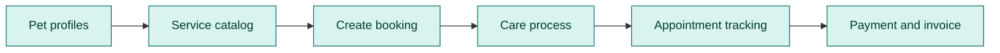
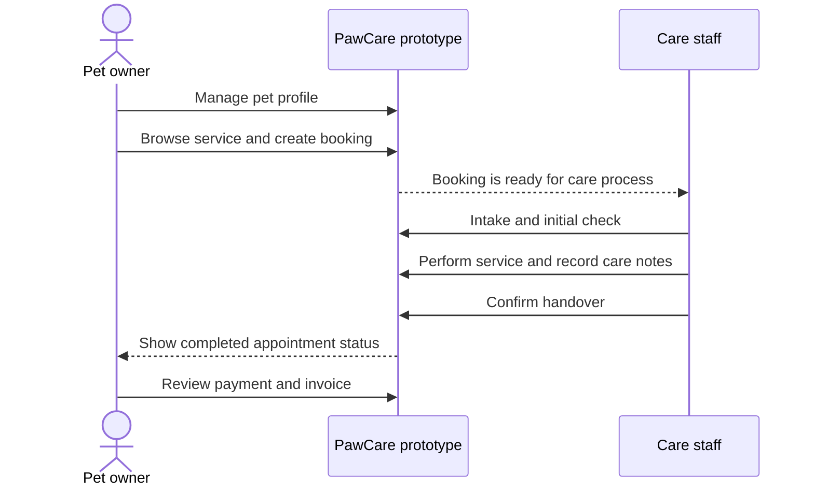
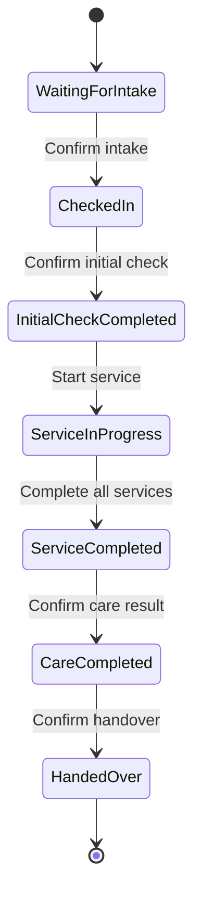
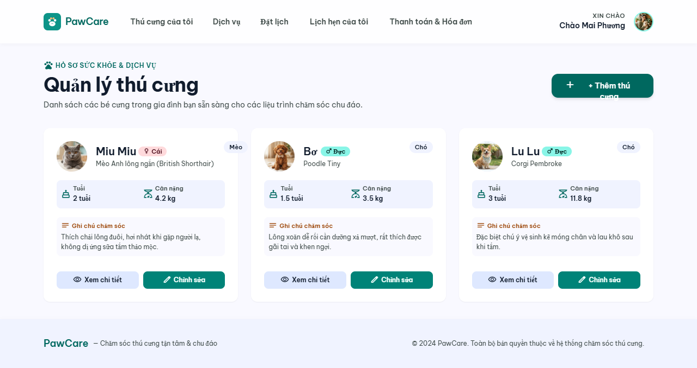
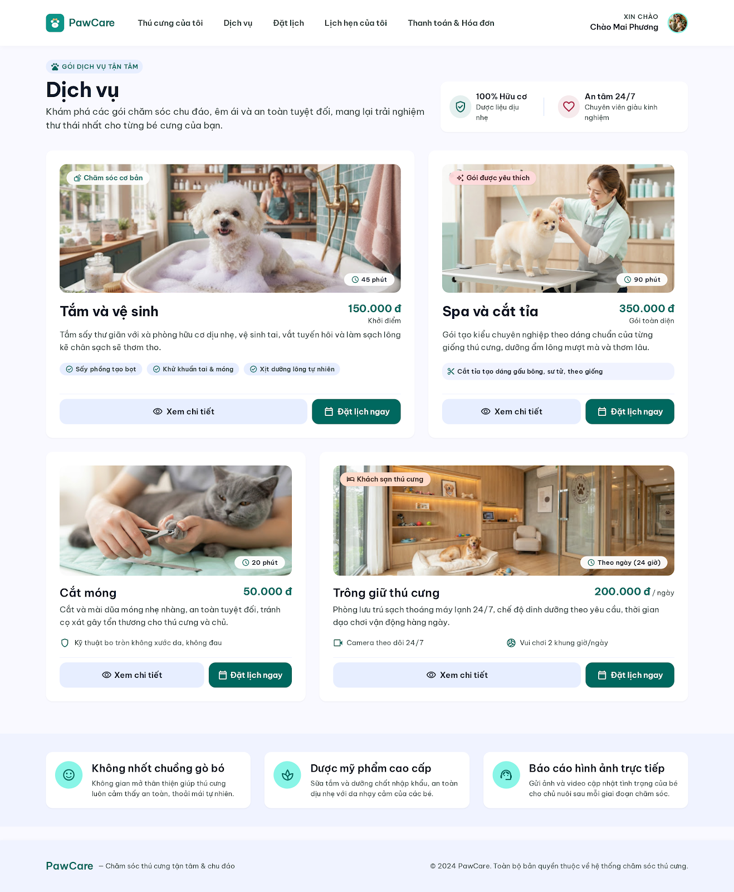
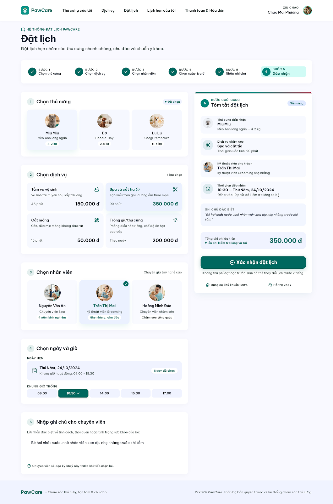
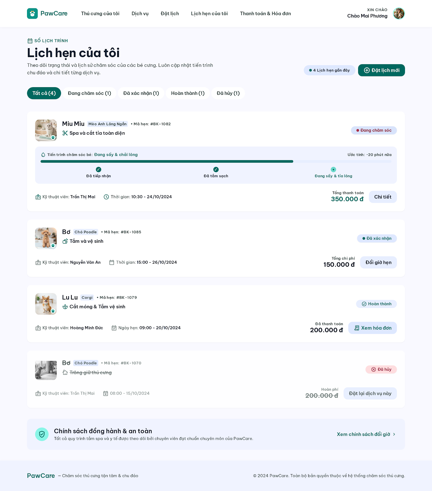
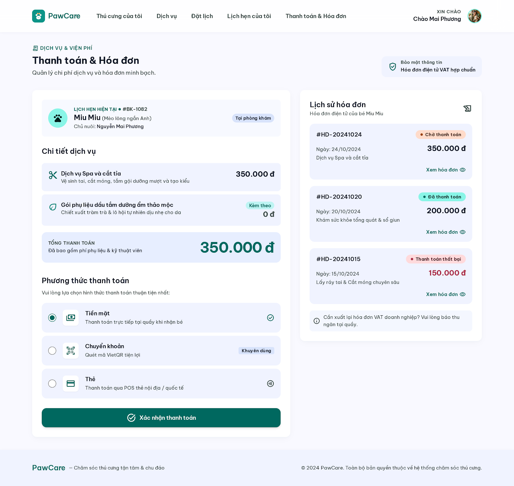
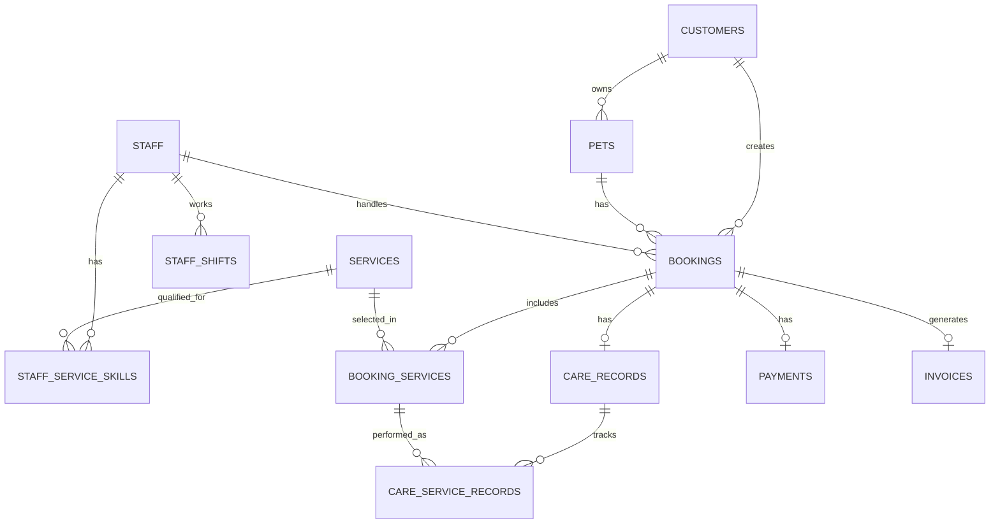

# PawCare

## Pet Care Service Management Prototype

PawCare is a static HTML prototype for managing pet profiles, services, bookings, care progress, appointment status, payments and invoices.

The project is designed as a focused prototype: the UI, system analysis, database schema and Mermaid diagrams describe one complete pet-care journey without adding a backend or real payment integration.



## System at a glance

| Dimension | Current prototype |
|---|---|
| Functional scope | 7 focused features |
| User roles | Pet owner, care staff and operations manager |
| UI technology | Static HTML, Tailwind CDN and vanilla JavaScript |
| Database design | SQLite-compatible SQL schema with 10 core tables |
| Diagram format | Mermaid ERD, use case, sequence and state diagrams |
| Currency | VND |
| Runtime | Local static web server |
| Backend | Not included |
| Authentication | Not included |
| Payment gateway | Not included; payment is simulated |

## Architecture views

### View 1: Top-down functional decomposition

```text
PawCare Pet Care Service Management
├── Pet Profile Management
│   ├── View pet list
│   ├── Add pet
│   ├── View pet details
│   └── Edit pet information
├── Service Catalog
│   ├── View service list
│   ├── View service details
│   ├── View price
│   └── View duration
├── Booking Management
│   ├── Select pet, service and staff
│   ├── Select date and time
│   ├── Add note
│   └── Review and confirm booking
├── Care Process Management
│   ├── Intake
│   ├── Initial check
│   ├── Service execution
│   ├── Care notes
│   └── Handover
├── Appointment Tracking
│   ├── View appointment information
│   └── View current status
    ├── Staff Management
    │   ├── Staff profiles
    │   ├── Work schedules
    │   ├── Appointment assignment
    │   └── Skills and workload
    └── Payment and Invoice
    ├── Review service cost
    ├── Select payment method
    ├── View payment status
    └── View invoice detail
```

## User flow

### Main user journey



### View 3: Care process lifecycle



The customer-facing appointment status remains `pending`, `confirmed`, `in_progress`, `completed` or `cancelled`. The detailed care lifecycle is described in the care process analysis and database records.

## User interface tour

The current UI is exported from Google Stitch and standardized as static HTML. The screenshots below are reference captures for the main customer flow.

### 1. Pet profiles

View, add, inspect and edit pet information.



### 2. Service catalog

Browse services, prices, durations and service details.



### 3. Create booking

Select the pet, service, staff member, date, time and note, then review the booking.



### 4. Appointment tracking

View appointment information, care progress and status.



### 5. Payment and invoice

Review costs, choose a payment method and open invoice details.



### 6. Care process

The staff workflow is implemented at [`pages/care-process.html`](pages/care-process.html). A final screenshot can be added after visual review of the new screen.

### 7. Staff management

The operations workspace covers staff profiles, schedules, appointment assignment, service skills and workload.

The screen is implemented at [`pages/staff-management.html`](pages/staff-management.html). The screenshot is a planned visual reference and can be added after the screen is reviewed locally.

## Complete screen index

| Screen | Role | Main capabilities | Route |
|---|---|---|---|
| My Pets | Pet owner | View, add, detail and edit pet profiles | [`pages/pets.html`](pages/pets.html) |
| Services | Pet owner | View service details, prices and durations | [`pages/services.html`](pages/services.html) |
| Booking | Pet owner | Select booking information and confirm | [`pages/booking.html`](pages/booking.html) |
| Care Process | Care staff | Intake, initial check, service execution, notes and handover | [`pages/care-process.html`](pages/care-process.html) |
| Staff Management | Operations manager | Profiles, schedules, assignments, skills and workload | [`pages/staff-management.html`](pages/staff-management.html) |
| My Appointments | Pet owner | View appointment details and status | [`pages/appointments.html`](pages/appointments.html) |
| Payment & Invoices | Pet owner | Review cost, payment status and invoice | [`pages/payments.html`](pages/payments.html) |

## UI to database traceability

| UI screen / feature | Main tables | Analysis |
|---|---|---|
| My Pets | `customers`, `pets` | [`pet-profile.md`](docs/analysis/features/pet-profile.md) |
| Services | `services` | [`service-catalog.md`](docs/analysis/features/service-catalog.md) |
| Booking | `pets`, `services`, `staff`, `bookings`, `booking_services` | [`create-booking.md`](docs/analysis/features/create-booking.md) |
| Care Process | `bookings`, `booking_services`, `care_records`, `care_service_records` | [`care-process.md`](docs/analysis/features/care-process.md) |
| Staff Management | `staff`, `staff_shifts`, `staff_skills`, `staff_service_skills`, `bookings` | [`staff-management.md`](docs/analysis/features/staff-management.md) |
| My Appointments | `bookings` | [`appointment-tracking.md`](docs/analysis/features/appointment-tracking.md) |
| Payment & Invoices | `bookings`, `booking_services`, `payments`, `invoices` | [`payment-and-invoice.md`](docs/analysis/features/payment-and-invoice.md) |

## Database

### Database architecture

The SQL schema is designed around the approved prototype scope:



Full field definitions are available in [`database/schema.sql`](database/schema.sql), and the detailed ERD is in [`docs/ERD.md`](docs/ERD.md).

## Documentation index

| Document | Topic | What it answers |
|---|---|---|
| [`docs/analysis/system-overview.md`](docs/analysis/system-overview.md) | System overview | Who uses the system and what the main flow is |
| [`docs/analysis/business-rules.md`](docs/analysis/business-rules.md) | Business rules | What the system allows or rejects |
| [`docs/analysis/traceability.md`](docs/analysis/traceability.md) | Traceability | How requirements map to screens and tables |
| [`docs/analysis/features/`](docs/analysis/features/) | Feature analysis | Use cases, sequences, validation and acceptance criteria |
| [`docs/DESIGN.md`](docs/DESIGN.md) | Design system | Colors, typography, spacing and components |
| [`docs/ERD.md`](docs/ERD.md) | Entity relationship design | Database entities and relationships |
| [`docs/petcare-system.xmind`](docs/petcare-system.xmind) | Original functional scope | Top-down functional decomposition reference |

## Run locally

### 1. Start a local server

From the project root:

```powershell
python -m http.server 8000
```

### 2. Open the prototype

Start with:

```text
http://localhost:8000/pages/pets.html
```

The navigation connects the main flow:

```text
My Pets → Services → Booking → Care Process → My Appointments → Payment & Invoices
```

Do not open the HTML files with `file://`; the prototype uses relative navigation between pages.

### 3. Verify the project

```powershell
powershell -NoProfile -File .\scripts\verify-navigation.ps1
powershell -NoProfile -File .\scripts\verify-project.ps1
```

The SQL schema can be checked with SQLite:

```powershell
python -c "import sqlite3,pathlib; db=sqlite3.connect(':memory:'); db.executescript(pathlib.Path('database/schema.sql').read_text(encoding='utf-8')); print('PASS: schema.sql executed in SQLite')"
```

## Scope boundaries

The prototype does not include authentication, backend APIs, realtime tracking, real payment gateways, advanced customer administration, branches, promotions, medical records, vaccination, GPS, live chat, video calls, payroll or analytics.

The care process is represented as a static staff workflow. It does not persist data to a live database.

## Project structure

```text
pages/       Static HTML screens
scripts/     Shared navigation and verification scripts
assets/      Logo, images and Stitch reference screenshots
docs/        Design system, ERD, XMind and system analysis
database/    SQLite-compatible SQL schema
```

## Repository

[GitHub repository](https://github.com/NguyenMinhHuy229/petcare)
