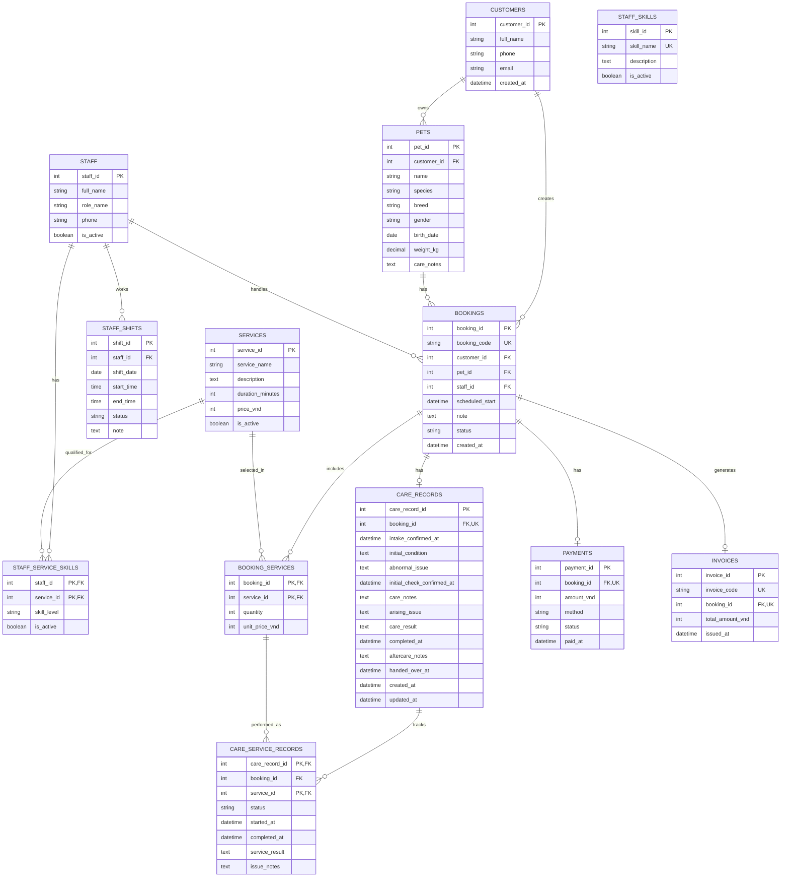

# PawCare ERD

This ERD covers the approved prototype scope: pet profiles, services, bookings, care process records, staff operations, status tracking, payments and invoices.

## Booking status

`bookings.status` supports the appointment tracking screen:

- `pending`: Awaiting confirmation
- `confirmed`: Confirmed
- `in_progress`: In progress
- `completed`: Completed
- `cancelled`: Cancelled

Runtime database and backend API are not included in the current prototype.
