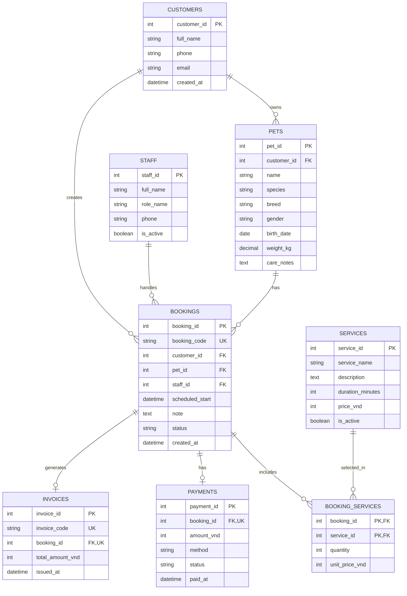

# PawCare ERD

ERD này chỉ mô tả phần prototype đã chốt: hồ sơ thú cưng, dịch vụ, đặt lịch, theo dõi trạng thái, thanh toán và hóa đơn.

## Booking status

`bookings.status` phục vụ màn hình theo dõi lịch hẹn:

- `pending`: Chờ xác nhận
- `confirmed`: Đã xác nhận
- `in_progress`: Đang chăm sóc
- `completed`: Hoàn thành
- `cancelled`: Đã hủy

Database runtime và backend API chưa nằm trong prototype hiện tại.
