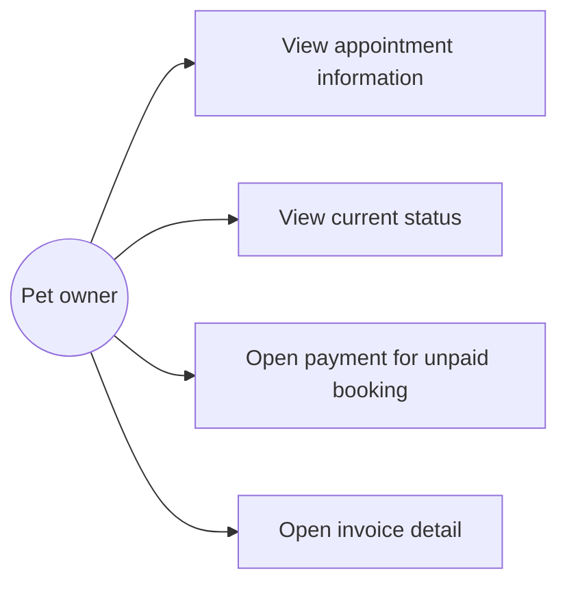
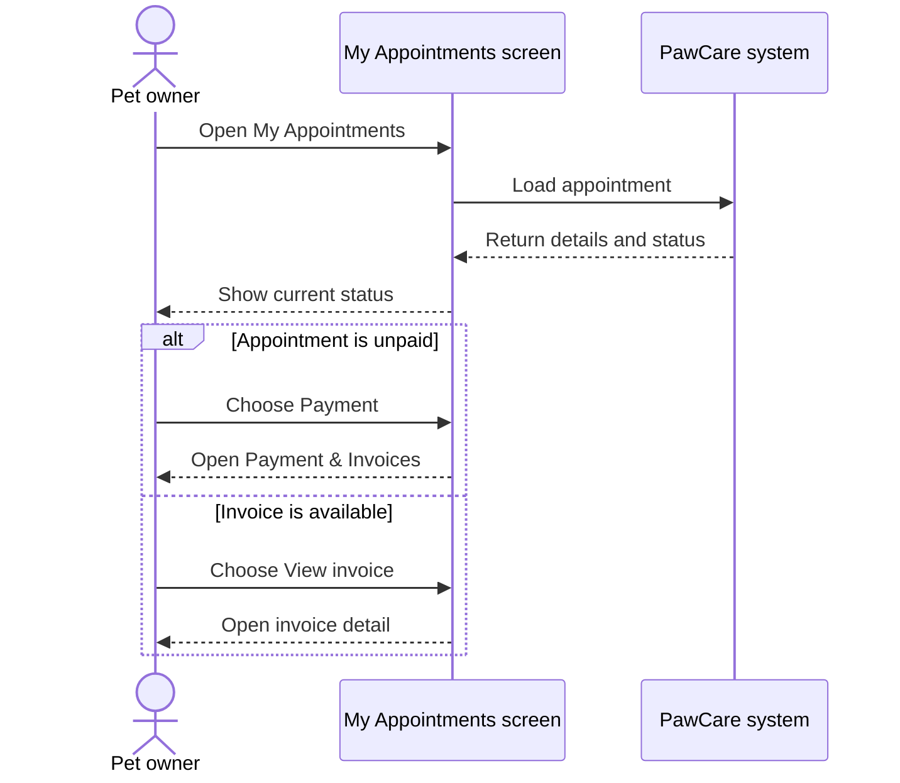

# Feature Analysis: Appointment Tracking

## Goal

Allow a pet owner to see appointment information and understand the current care status.

## Main flow

1. The owner opens My Appointments.
2. The system shows appointment code, pet, service, date, time and staff.
3. The system shows the current status.
4. If the appointment is unpaid, the owner can open Payment & Invoices.
5. If an invoice exists, the owner can open its detail.

## Use case diagram

## Sequence diagram

## Data

The `bookings` table supplies the appointment details and `status`. Payment and invoice links use `payments` and `invoices`.

## Rules and validation

- Status must be one of the five allowed values.
- The status shown to the user must match the stored status.
- Payment is offered only for an unpaid appointment.
- Invoice detail is opened using the booking's invoice reference.

## Acceptance criteria

- Appointment information is readable.
- The current status is visible.
- Each status has a clear label.
- An unpaid appointment has a payment action.
- The invoice action opens invoice detail.
