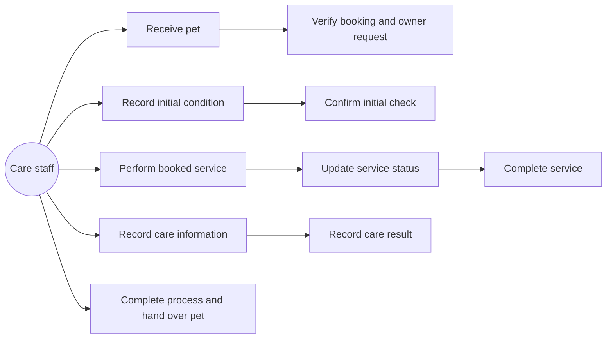
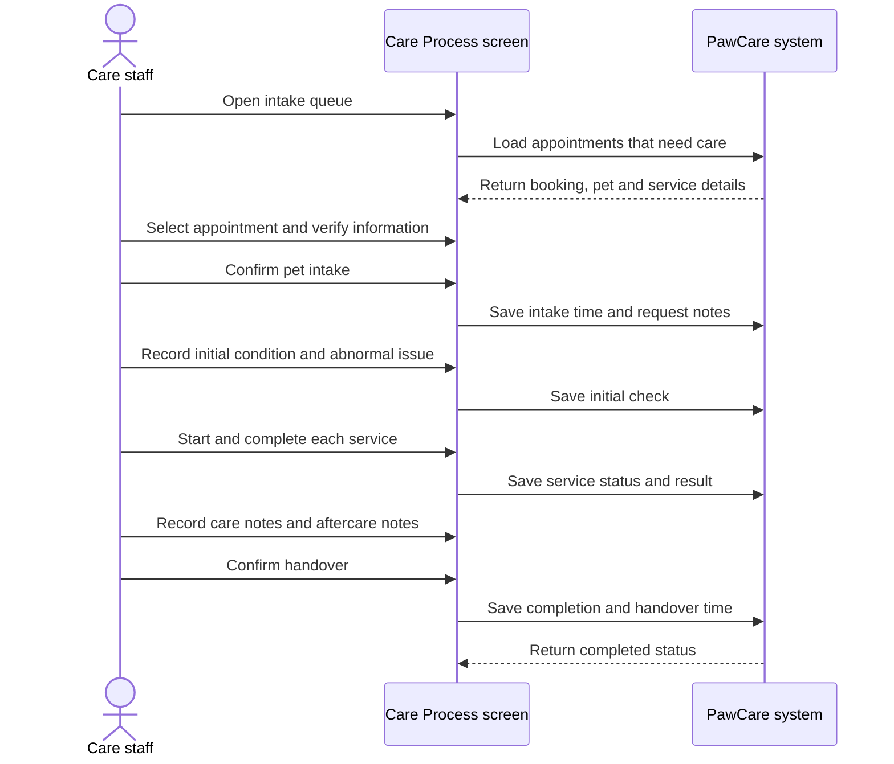
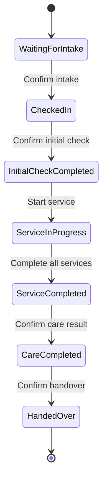

# Feature Analysis: Care Process Management

## Goal

Allow care staff to receive a pet, record the initial condition, perform each booked service, document the result and confirm handover.

## Actor

The main actor is a **care staff member**. The pet owner is affected by the result and can later see the booking status, payment and invoice from the customer screens.

## Main flow

1. Staff opens the Care Process screen.
2. Staff selects an appointment from the intake queue.
3. Staff verifies the booking, pet and owner request.
4. Staff confirms that the pet has been received.
5. Staff records the initial condition and any abnormal issue.
6. Staff confirms the initial check.
7. Staff views the booked services and starts the service work.
8. Staff updates each service to in progress and then completed.
9. Staff records performed services, care information, arising issues and the care result.
10. Staff checks the result and writes aftercare notes.
11. Staff confirms the care process and pet handover.
12. The appointment becomes `completed` for customer tracking.

## Use case diagram

## Sequence diagram

## Process states

The booking status remains the customer-facing summary. The detailed process state is represented by timestamps in `care_records`, service statuses in `care_service_records` and the UI step currently selected.

## Data mapping

- `bookings`: identifies the appointment and stores the customer-facing status.
- `pets`: supplies pet identity and care notes.
- `booking_services`: identifies the services selected in the booking.
- `care_records`: stores intake, initial check, overall notes, result and handover information.
- `care_service_records`: stores the progress and result of each selected service.

## Business rules

1. A care record belongs to exactly one booking.
2. A booking can have at most one care record in this prototype.
3. A care service record must refer to a service already selected in `booking_services`.
4. A service must be started before it can be completed.
5. The overall care process cannot be completed until all selected services are completed.
6. Abnormal issues must be recorded even when the value is explicitly `None observed`.
7. Handover requires a checked result and aftercare notes.
8. Handover changes the related booking status to `completed`.
9. This prototype records staff actions locally in the static UI; it does not call an API.

## Validation and alternative flows

- If the booking information does not match, staff must not confirm intake.
- If an abnormal issue is found, staff records it before continuing.
- If a service cannot be completed, staff keeps its status in progress and records the reason.
- If handover information is incomplete, the system does not confirm handover.

## Acceptance criteria

- Staff can see a queue of appointments.
- Staff can select an appointment and review pet, booking and service information.
- Staff can move through Intake, Initial check, Service execution, Care notes and Handover.
- Staff can update an individual service to in progress or completed.
- Staff can record initial condition, abnormal issue, care result and aftercare notes.
- Confirming handover shows the care process as completed.
- The customer appointment flow can still show the final `completed` status.
