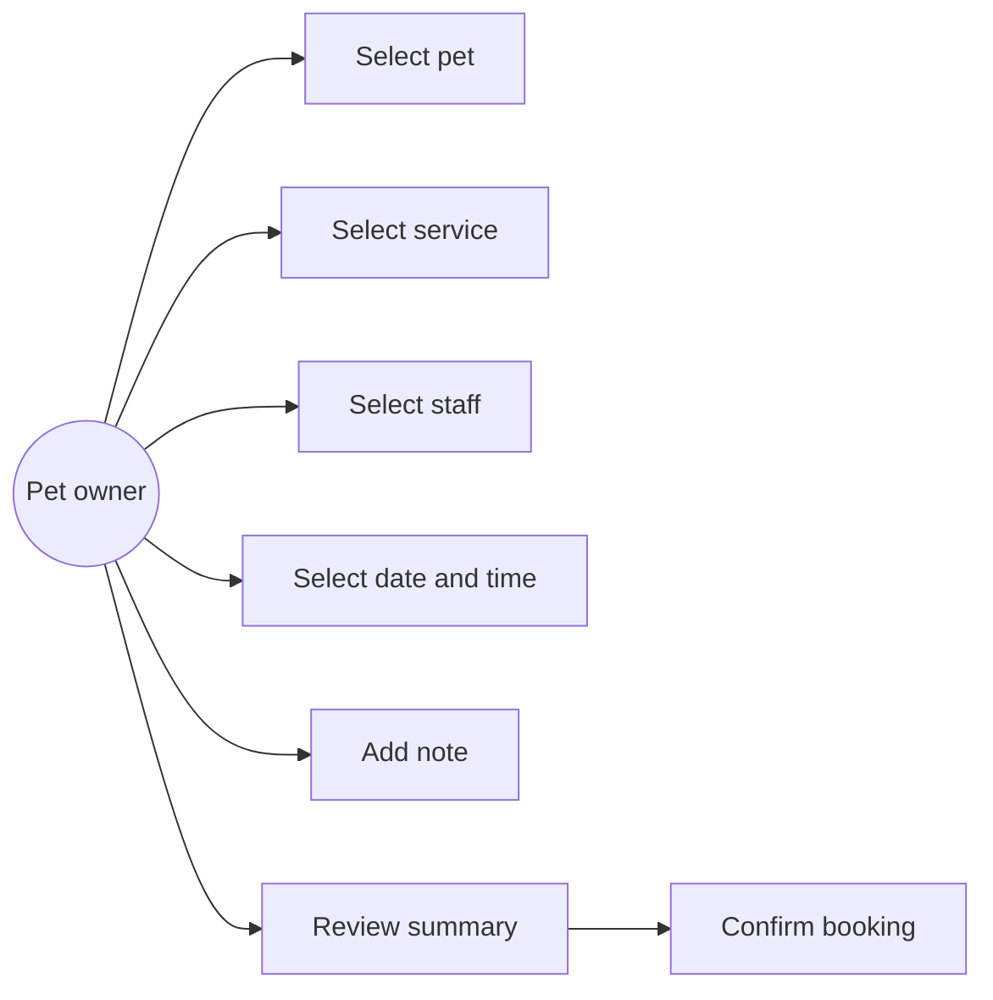
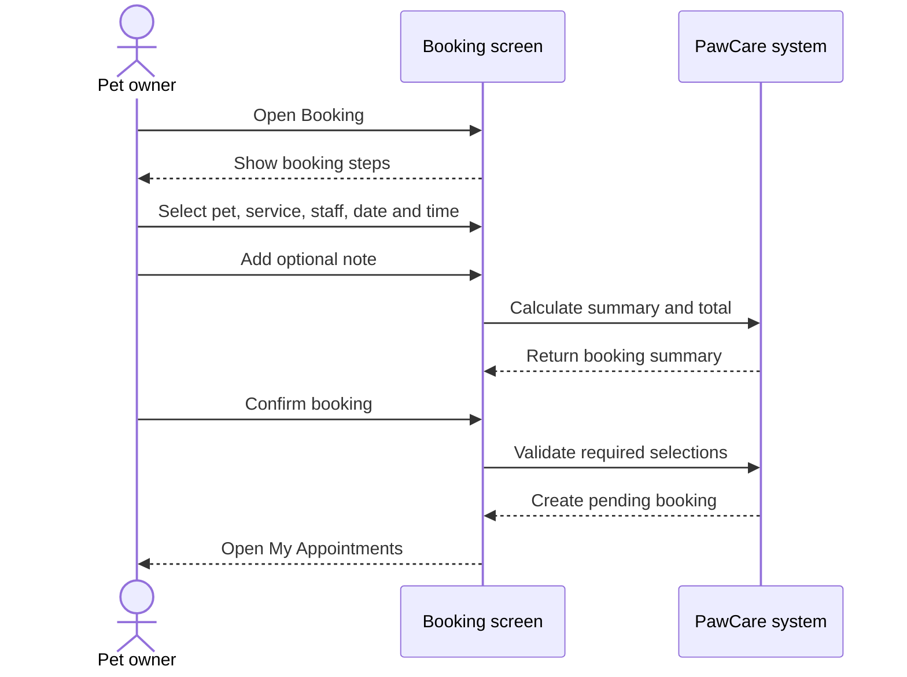

# Feature Analysis: Create Booking

## Goal

Allow a pet owner to request one or more services for a selected pet, staff member, date and time.

## Main flow

1. The owner opens Booking.
2. The owner selects a pet.
3. The owner selects a service.
4. The owner selects a staff member.
5. The owner selects date and time.
6. The owner enters an optional note.
7. The owner reviews the summary and total.
8. The owner confirms the booking.
9. The system creates a booking with `pending` status and opens My Appointments.

## Use case diagram

## Sequence diagram

## Data

- `bookings` stores the appointment, owner, pet, staff, time, note and status.
- `booking_services` stores each selected service, quantity and price snapshot.
- `pets`, `services` and `staff` provide selectable records.

## Rules and validation

- Pet, service, date and time are required.
- Staff is optional in the database because assignment may happen later.
- At least one service is required.
- The first status is `pending`.
- The total is calculated from selected service lines.

## Acceptance criteria

- The owner can complete the six booking steps.
- The review area reflects the selected information.
- The confirmation action opens My Appointments.
- The created booking is represented as pending.
