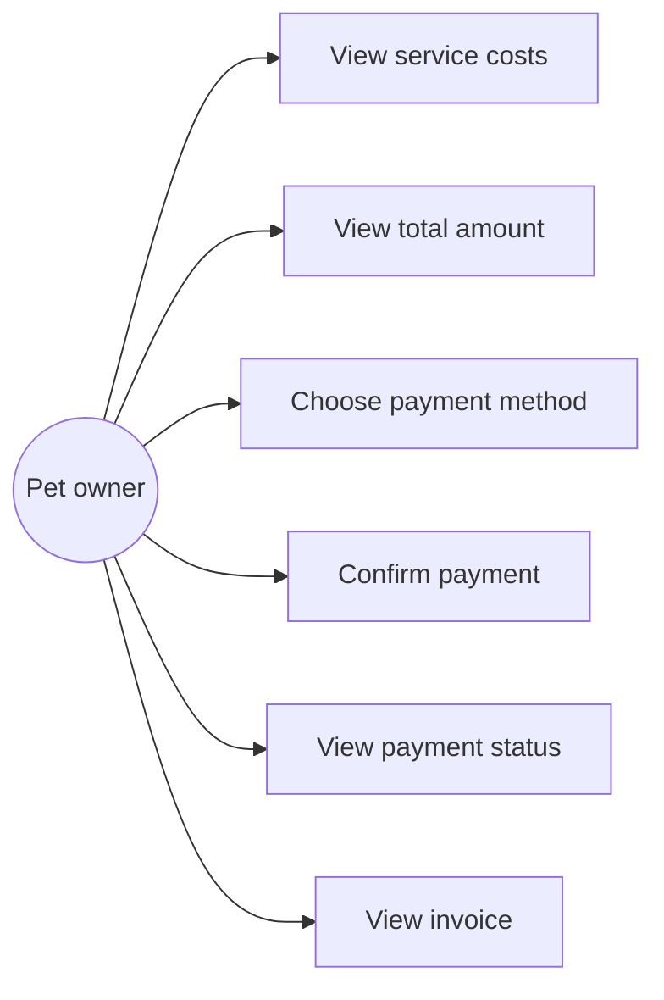
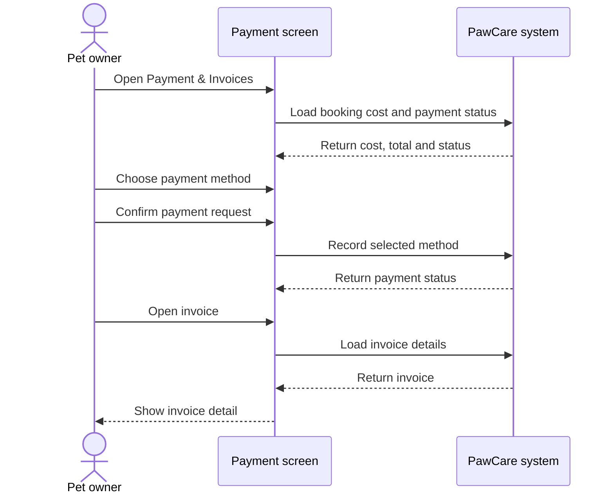

# Feature Analysis: Payment and Invoice

## Goal

Allow a pet owner to review appointment costs, choose a payment method, see payment status and open an invoice.

## Main flow

1. The owner opens Payment & Invoices.
2. The system shows the selected appointment and service costs.
3. The system shows the total amount in VND.
4. The owner chooses cash, bank transfer or card.
5. The owner confirms the payment request.
6. The system shows the payment status.
7. The owner can open an invoice detail from the invoice list.

## Use case diagram

## Sequence diagram

## Data

- `bookings` identifies the appointment being paid.
- `booking_services` provides service lines and price snapshots.
- `payments` stores amount, method, status and paid time.
- `invoices` stores invoice code and total amount.

## Rules and validation

- Amount cannot be negative.
- The method must be cash, bank transfer or card.
- Payment status must be pending, paid, failed or refunded.
- The prototype allows one payment record and one invoice per booking.
- A real gateway is outside the current scope.

## Acceptance criteria

- Service costs and total are visible.
- The three supported payment methods can be selected.
- The payment confirmation shows a result status.
- Existing invoices can be opened in detail.
- All displayed amounts use VND.
