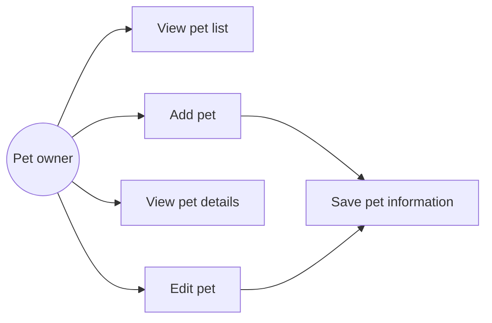
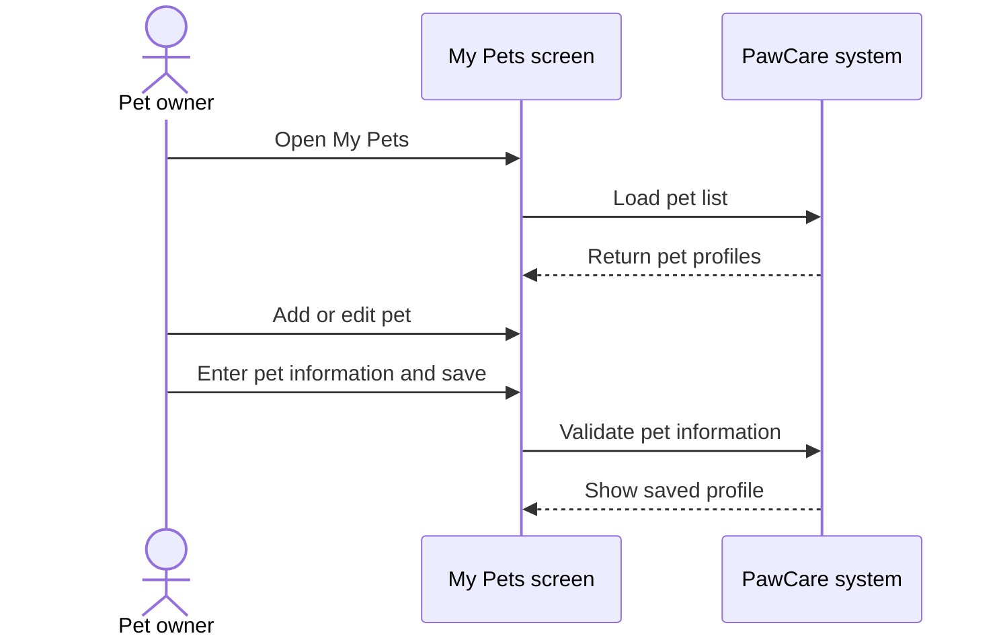

# Feature Analysis: Pet Profile Management

## Goal

Allow a pet owner to see, add, inspect and edit pet information used during booking.

## Main flow

1. The owner opens My Pets.
2. The system shows existing pet cards.
3. The owner chooses Add Pet or opens an existing pet.
4. The owner enters or changes the pet information.
5. The owner saves the form.
6. The system shows the updated pet information.

## Use case diagram

## Sequence diagram

## Data

- `customers.customer_id` identifies the owner.
- `pets` stores name, species, breed, gender, birth date, weight and care notes.

## Rules and validation

- Name and species are required.
- Weight, if provided, must be a non-negative number.
- Care notes are optional.
- The pet must remain linked to a customer.

## Acceptance criteria

- The owner can see existing pets.
- The owner can add a pet with valid required fields.
- The owner can view details.
- The owner can edit and save existing information.
- Invalid required fields are not accepted.
