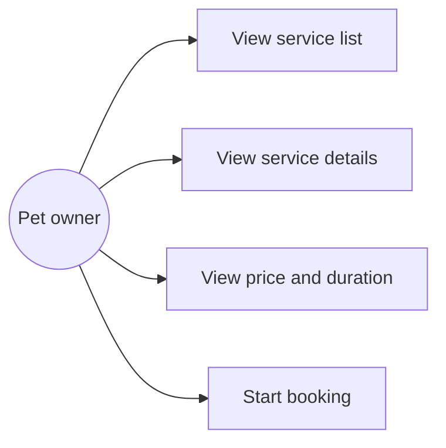
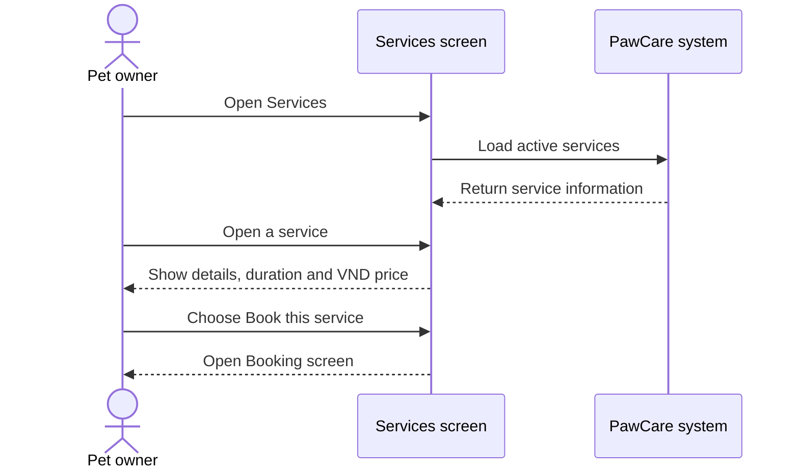

# Feature Analysis: Service Catalog

## Goal

Allow a pet owner to understand each available service before creating a booking.

## Main flow

1. The owner opens Services.
2. The system shows active services.
3. The owner reviews the name, description, duration and VND price.
4. The owner opens service details if more information is needed.
5. The owner chooses Book this service.
6. The system opens the booking screen.

## Use case diagram

## Sequence diagram

## Data

The `services` table provides the name, description, duration, price and active flag.

## Rules and validation

- Only active services are shown.
- Duration must be greater than zero.
- Price cannot be negative.
- Service details are read-only in this customer flow.

## Acceptance criteria

- The service list is visible.
- Each service shows its duration and VND price.
- Details can be opened.
- Every in-scope booking button opens the Booking screen.
