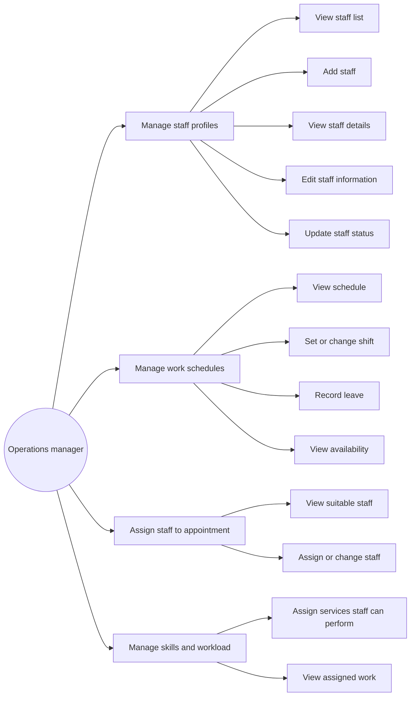
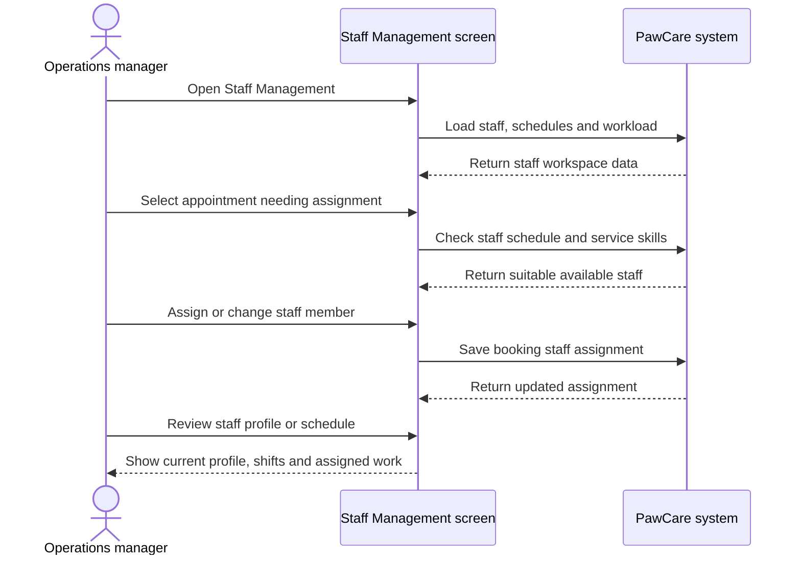

# Feature Analysis: Staff Management

## Goal

Allow an operations user to maintain staff profiles, schedules, service skills and appointment assignments so care work can be planned safely.

## Actors

The main actor is an **operations manager**. Care staff appear as selectable staff members and receive the assigned work in the care process.

## Main flow

1. The manager opens Staff Management.
2. The manager views the staff list and selects a staff member.
3. The manager adds, edits or deactivates a staff profile.
4. The manager views or changes a staff shift and records leave.
5. The manager opens an appointment that needs assignment.
6. The system shows available staff based on schedule and assigned skills.
7. The manager assigns or changes the staff member on the booking.
8. The manager reviews service skills and current workload.

## Use case diagram

## Sequence diagram

## Data mapping

- `staff`: profile, role, contact information and active status.
- `staff_shifts`: working hours, leave and availability for a date.
- `staff_skills`: reusable service skill definitions.
- `staff_service_skills`: many-to-many relationship between staff and services, including skill level.
- `bookings.staff_id`: the current staff member assigned to an appointment.

## Business rules

1. An inactive staff member cannot receive a new assignment.
2. A scheduled shift requires a start and end time.
3. Leave and unavailable records do not require working hours.
4. A staff member should only be suggested when available for the appointment time.
5. A staff member should only be suggested when qualified for the selected service.
6. A booking has one current assigned staff member; changing the assignment replaces the current value.
7. A staff member can perform many services and a service can be performed by many staff members.
8. The current prototype does not calculate overtime, payroll or advanced workload optimization.

## Validation and alternative flows

- If no suitable staff member is available, the manager keeps the booking unassigned.
- If a selected staff member is on leave, the assignment is rejected and another staff member must be selected.
- If the selected staff member lacks the service skill, the system does not suggest that person.
- Deactivating a staff member does not delete historical bookings.

## Acceptance criteria

- The manager can view staff profiles.
- The manager can add, edit and update staff status in the prototype.
- The manager can view shifts, change a shift and record leave.
- The manager can see appointments needing assignment.
- The manager can view suitable staff and assign a staff member.
- The manager can review service skills and assigned workload.
- Staff assignment remains connected to the booking through `bookings.staff_id`.
