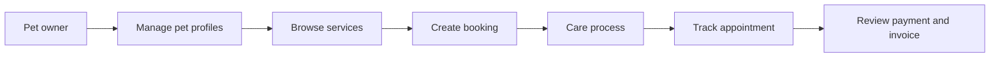
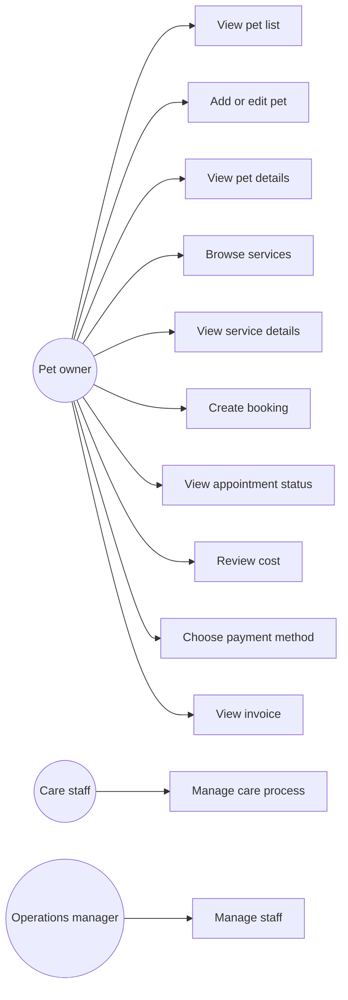

# System Overview

## Purpose

PawCare helps a pet owner choose a service, book a visit, track the visit status and review payment information.

## Main user

The main user is a **pet owner**. Staff and payment providers are represented as stored information in this prototype; they do not operate a separate screen.

## Overall user journey

## High-level use case diagram

## Feature boundaries

| Feature | User goal | Main screen | Main data |
|---|---|---|---|
| Pet profile | Keep pet information available for future bookings | `pages/pets.html` | `customers`, `pets` |
| Service catalog | Understand available services, prices and duration | `pages/services.html` | `services` |
| Create booking | Request a service at a selected time | `pages/booking.html` | `bookings`, `booking_services` |
| Care process | Receive, perform and hand over the pet | `pages/care-process.html` | `care_records`, `care_service_records` |
| Staff management | Manage profiles, shifts, skills and assignments | `pages/staff-management.html` | `staff`, `staff_shifts`, `staff_skills`, `staff_service_skills`, `bookings` |
| Appointment tracking | See booking details and current progress | `pages/appointments.html` | `bookings` |
| Payment and invoice | Review cost, payment status and invoice detail | `pages/payments.html` | `payments`, `invoices` |

## Prototype behavior

The HTML pages use sample data and shared navigation JavaScript. A button changes screen or opens a modal; it does not write to a live database. The SQL schema describes how the same flow can be stored in a real system later.
