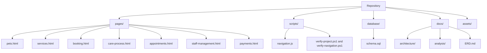

# C4: Code View

This is a lightweight file-level view. The project uses separate HTML pages and small scripts, so there are no classes or server modules to draw. The table below shows the real files that implement each part.

## File responsibilities

| File or folder | What it does |
|---|---|
| `pages/*.html` | Contains one visible screen and its local static interactions. |
| `scripts/navigation.js` | Connects route markers, buttons and status actions across pages. |
| `scripts/verify-*.ps1` | Checks required screens, routes, scope labels and schema structure. |
| `database/schema.sql` | Defines the planned tables, relationships and data checks. |
| `docs/analysis/features/*.md` | Explains user steps, rules and expected results for each feature. |
| `docs/ERD.md` | Shows how the planned tables relate to each other. |
| `docs/DESIGN.md` | Records the shared visual choices. |
| `assets/` | Stores screenshots, logo and supporting visual material. |
