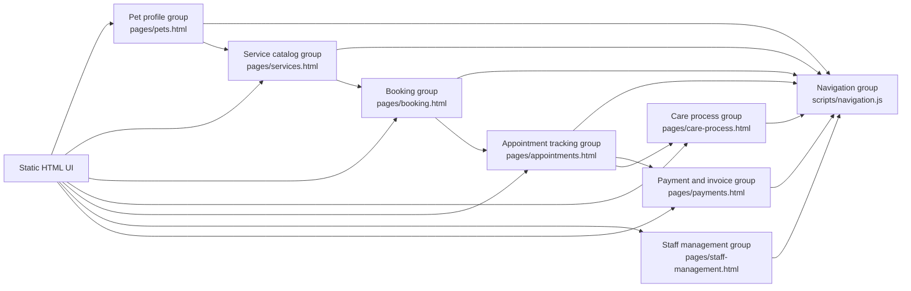

# C4: Component View

The repository is small and does not contain a backend class structure. This view therefore groups related behaviour inside the static UI and shared browser script. These are logical groups, not separately running programs.

## Main responsibilities

- **Pet profile group:** lists, adds, views and edits pet information.
- **Service catalog group:** shows available service names, prices and durations.
- **Booking group:** collects pet, service, staff, time and note information.
- **Care process group:** shows intake, check, service execution, notes and handover.
- **Appointment tracking group:** shows the booking and its current status.
- **Staff management group:** shows profiles, schedules, skills and assignment work.
- **Payment and invoice group:** shows cost, payment status and invoice detail.
- **Navigation group:** turns shared actions and route markers into links between pages.
