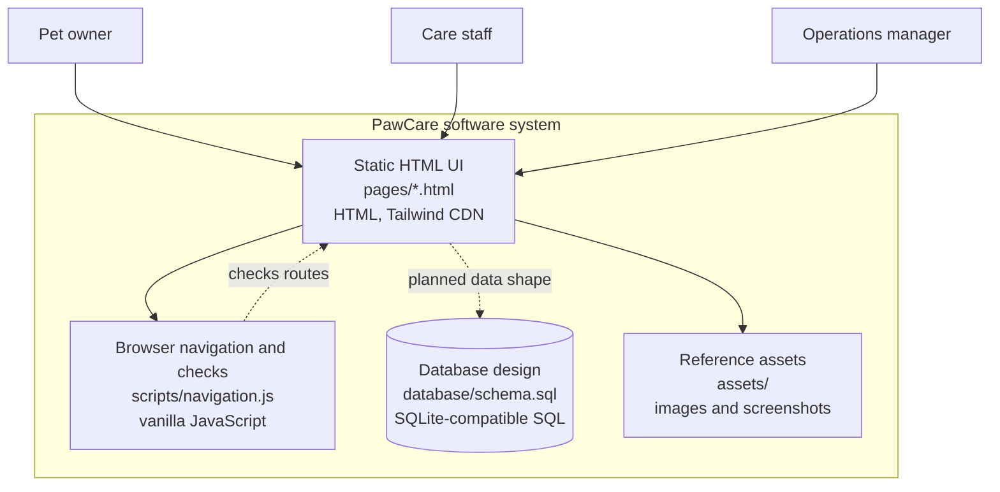

# C4: Container View

In this document, a container means a running application or a data store. It does not mean Docker.

## Container responsibilities

| Container | Responsibility | Current state |
|---|---|---|
| Static HTML UI | Shows the seven main screens and static interactions. | Implemented |
| Browser navigation and checks | Connects pages and validates important links. | Implemented |
| Database design | Describes customers, pets, services, bookings, care, staff, payments and invoices. | Design only |
| Reference assets | Holds screenshots, logo and supporting images from the UI work. | Implemented |

There is deliberately no API container, authentication container or real payment container in this prototype.
