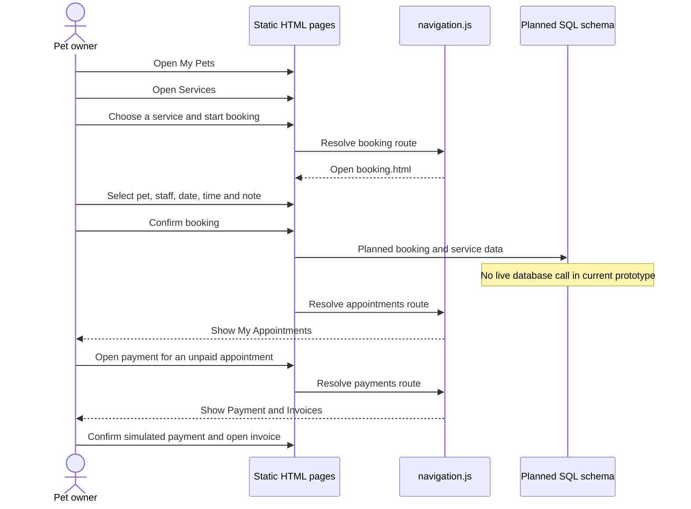
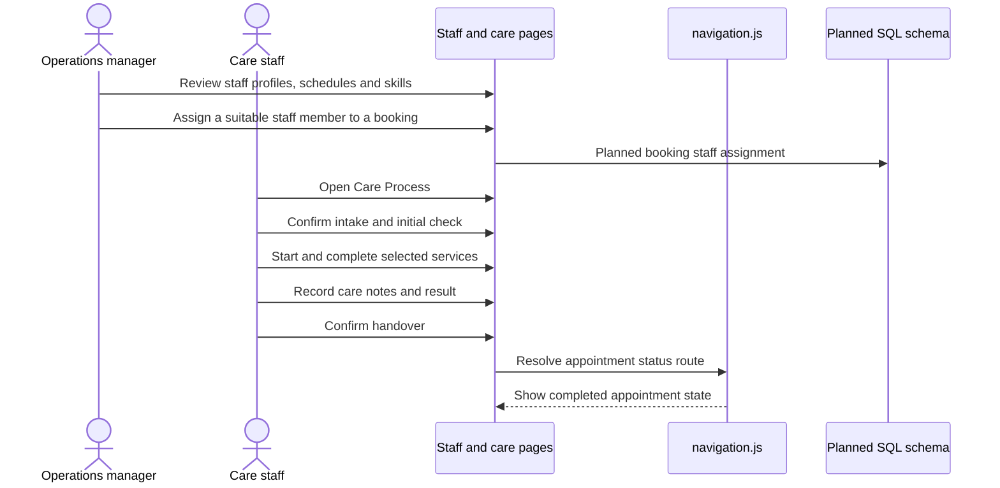

# C4: Dynamic Flows

These diagrams show the order of actions in the two most important journeys. They describe the current static prototype and mark database work as planned rather than live.

## Booking to payment

## Staff assignment and care process

The order is visible in the prototype, but the actions do not persist to a live database until a backend is added in a future scope.
