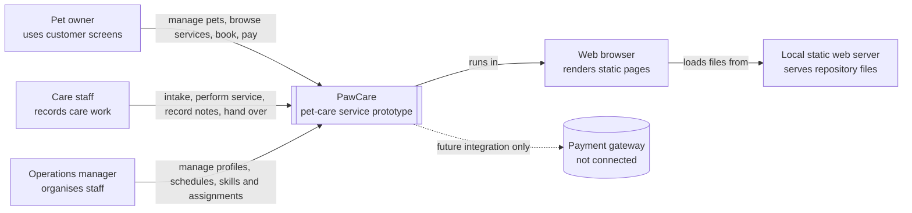

# C4: System Context

This view answers: who is around PawCare, and what does PawCare do for them?

## Scope notes

- PawCare is the system being described.
- The browser and local server are how the current prototype is viewed.
- The payment gateway is shown only to make the boundary clear; no real gateway is implemented.
- Customer administration, authentication and notification systems are outside the current boundary.
